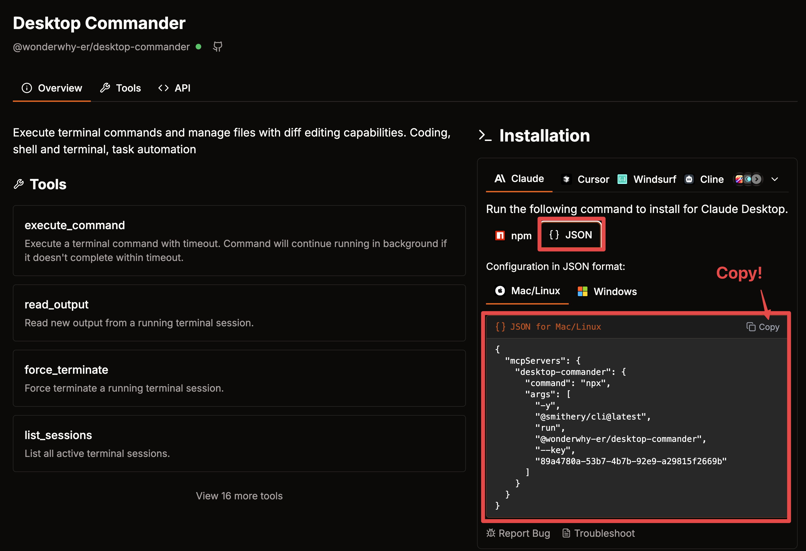
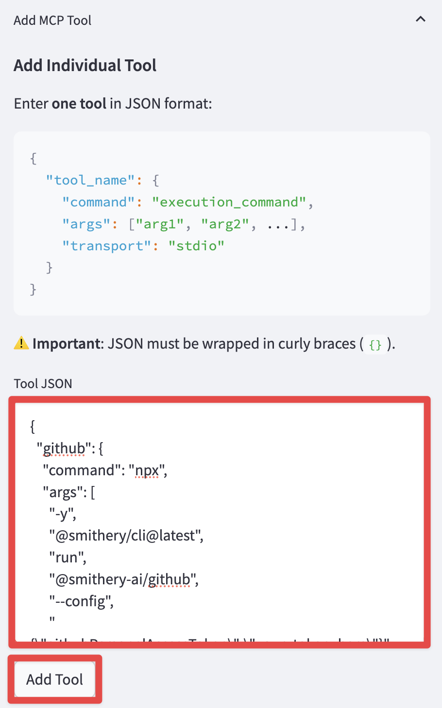
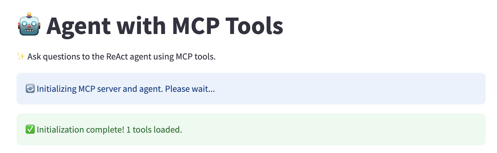

# LangGraph Agents + MCP

[](README.md) [](README_KOR.md)

[](https://github.com/teddylee777/langgraph-mcp-agents)
[](https://opensource.org/licenses/MIT)
[](https://www.python.org/)
[](https://github.com/teddylee777/langgraph-mcp-agents)


## Project Overview


`LangChain-MCP-Adapters` is a toolkit provided by **LangChain AI** that enables AI agents to interact with external tools and data sources through the Model Context Protocol (MCP). This project provides a user-friendly interface for deploying ReAct agents that can access various data sources and APIs through MCP tools.

### Features

- **Streamlit Interface**: A user-friendly web interface for interacting with LangGraph `ReAct Agent` with MCP tools
- **Tool Management**: Add, remove, and configure MCP tools through the UI (Smithery JSON format supported). This is done dynamically without restarting the application
- **Streaming Responses**: View agent responses and tool calls in real-time
- **Conversation History**: Track and manage conversations with the agent

## MCP Architecture

The Model Context Protocol (MCP) consists of three main components:

1. **MCP Host**: Programs seeking to access data through MCP, such as Claude Desktop, IDEs, or LangChain/LangGraph.

2. **MCP Client**: A protocol client that maintains a 1:1 connection with the server, acting as an intermediary between the host and server.

3. **MCP Server**: A lightweight program that exposes specific functionalities through a standardized model context protocol, serving as the primary data source.

## Quick Start with Docker

You can easily run this project using Docker without setting up a local Python environment.

### Requirements (Docker Desktop)

Install Docker Desktop from the link below:

- [Install Docker Desktop](https://www.docker.com/products/docker-desktop/)

### Run with Docker Compose

1. Navigate to the `dockers` directory

```bash
cd dockers
```

2. Create a `.env` file with your API keys in the project root directory.

```bash
cp .env.example .env
```

Enter your obtained API keys in the `.env` file.

(Note) Not all API keys are required. Only enter the ones you need.
- `ANTHROPIC_API_KEY`: If you enter an Anthropic API key, you can use "claude-3-7-sonnet-latest", "claude-3-5-sonnet-latest", "claude-3-haiku-latest" models.
- `OPENAI_API_KEY`: If you enter an OpenAI API key, you can use "gpt-4o", "gpt-4o-mini" models.
- `LANGSMITH_API_KEY`: If you enter a LangSmith API key, you can use LangSmith tracing.

```bash
ANTHROPIC_API_KEY=your_anthropic_api_key
OPENAI_API_KEY=your_openai_api_key
LANGSMITH_API_KEY=your_langsmith_api_key
LANGSMITH_TRACING=true
LANGSMITH_ENDPOINT=https://api.smith.langchain.com
LANGSMITH_PROJECT=LangGraph-MCP-Agents
```

When using the login feature, set `USE_LOGIN` to `true` and enter `USER_ID` and `USER_PASSWORD`.

```bash
USE_LOGIN=true
USER_ID=admin
USER_PASSWORD=admin123
```

If you don't want to use the login feature, set `USE_LOGIN` to `false`.

```bash
USE_LOGIN=false
```

3. Select the Docker Compose file that matches your system architecture.

**AMD64/x86_64 Architecture (Intel/AMD Processors)**

```bash
# Run container
docker compose -f docker-compose.yaml up -d
```

**ARM64 Architecture (Apple Silicon M1/M2/M3/M4)**

```bash
# Run container
docker compose -f docker-compose-mac.yaml up -d
```

4. Access the application in your browser at http://localhost:8585

(Note)
- If you need to modify ports or other settings, edit the docker-compose.yaml file before building.

## Install Directly from Source Code

1. Clone this repository

```bash
git clone https://github.com/teddynote-lab/langgraph-mcp-agents.git
cd langgraph-mcp-agents
```

2. Create a virtual environment and install dependencies using uv

```bash
uv venv
uv pip install -r requirements.txt
source .venv/bin/activate  # For Windows: .venv\Scripts\activate
```

3. Create a `.env` file with your API keys (copy from `.env.example`)

```bash
cp .env.example .env
```

Enter your obtained API keys in the `.env` file.

(Note) Not all API keys are required. Only enter the ones you need.
- `ANTHROPIC_API_KEY`: If you enter an Anthropic API key, you can use "claude-3-7-sonnet-latest", "claude-3-5-sonnet-latest", "claude-3-haiku-latest" models.
- `OPENAI_API_KEY`: If you enter an OpenAI API key, you can use "gpt-4o", "gpt-4o-mini" models.
- `LANGSMITH_API_KEY`: If you enter a LangSmith API key, you can use LangSmith tracing.
```bash
ANTHROPIC_API_KEY=your_anthropic_api_key
OPENAI_API_KEY=your_openai_api_key
LANGSMITH_API_KEY=your_langsmith_api_key
LANGSMITH_TRACING=true
LANGSMITH_ENDPOINT=https://api.smith.langchain.com
LANGSMITH_PROJECT=LangGraph-MCP-Agents
```

4. (New) Use the login/logout feature

When using the login feature, set `USE_LOGIN` to `true` and enter `USER_ID` and `USER_PASSWORD`.

```bash
USE_LOGIN=true
USER_ID=admin
USER_PASSWORD=admin123
```

If you don't want to use the login feature, set `USE_LOGIN` to `false`.

```bash
USE_LOGIN=false
```

## Usage

1. Start the Streamlit application.

```bash
streamlit run app.py
```

2. The application will run in the browser and display the main interface.

3. Use the sidebar to add and configure MCP tools

Visit [Smithery](https://smithery.ai/) to find useful MCP servers.

First, select the tool you want to use.

Click the COPY button in the JSON configuration on the right.



Paste the copied JSON string in the `Tool JSON` section.



Click the `Add Tool` button to add it to the "Registered Tools List" section.

Finally, click the "Apply" button to apply the changes to initialize the agent with the new tools.


4. Check the agent's status.



5. Interact with the ReAct agent that utilizes the configured MCP tools by asking questions in the chat interface.


## Hands-on Tutorial

For developers who want to learn more deeply about how MCP and LangGraph integration works, we provide a comprehensive Jupyter notebook tutorial:

- Link: [MCP-HandsOn-KOR.ipynb](./MCP-HandsOn-KOR.ipynb)

This hands-on tutorial covers:

1. **MCP Client Setup** - Learn how to configure and initialize the MultiServerMCPClient to connect to MCP servers
2. **Local MCP Server Integration** - Connect to locally running MCP servers via SSE and Stdio methods
3. **RAG Integration** - Access retriever tools using MCP for document retrieval capabilities
4. **Mixed Transport Methods** - Combine different transport protocols (SSE and Stdio) in a single agent
5. **LangChain Tools + MCP** - Integrate native LangChain tools alongside MCP tools

This tutorial provides practical examples with step-by-step explanations that help you understand how to build and integrate MCP tools into LangGraph agents.

## License

MIT License 

## References

- https://github.com/langchain-ai/langchain-mcp-adapters