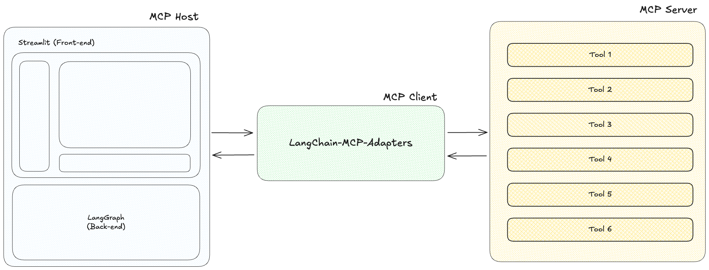

# LangGraph 에이전트 + MCP

[](README.md) [](README_KOR.md)

[](https://github.com/teddylee777/langgraph-mcp-agents)
[](https://opensource.org/licenses/MIT)
[](https://www.python.org/)
[](https://github.com/teddylee777/langgraph-mcp-agents)


## 프로젝트 개요



`LangChain-MCP-Adapters`는 **LangChain AI**에서 제공하는 툴킷으로, AI 에이전트가 Model Context Protocol(MCP)을 통해 외부 도구 및 데이터 소스와 상호작용할 수 있게 해줍니다. 이 프로젝트는 MCP 도구를 통해 다양한 데이터 소스와 API에 접근할 수 있는 ReAct 에이전트를 배포하기 위한 사용자 친화적인 인터페이스를 제공합니다.

### 특징

- **Streamlit 인터페이스**: MCP 도구가 포함된 LangGraph `ReAct Agent`와 상호작용하기 위한 사용자 친화적인 웹 인터페이스
- **도구 관리**: UI를 통해 MCP 도구를 추가, 제거 및 구성(Smithery JSON 형식 지원). 애플리케이션을 재시작하지 않고도 동적으로 이루어집니다.
- **스트리밍 응답**: 에이전트 응답과 도구 호출을 실시간으로 확인
- **대화 기록**: 에이전트와의 대화 추적 및 관리

## MCP 아키텍처

MCP(Model Context Protocol)는 세 가지 주요 구성 요소로 이루어져 있습니다.

1. **MCP 호스트**: Claude Desktop, IDE 또는 LangChain/LangGraph와 같이 MCP를 통해 데이터에 접근하고자 하는 프로그램.

2. **MCP 클라이언트**: 서버와 1:1 연결을 유지하는 프로토콜 클라이언트로, 호스트와 서버 사이의 중개자 역할을 합니다.

3. **MCP 서버**: 표준화된 모델 컨텍스트 프로토콜을 통해 특정 기능을 노출하는 경량 프로그램으로, 주요 데이터 소스 역할을 합니다.

## Docker 로 빠른 실행

로컬 Python 환경을 설정하지 않고도 Docker를 사용하여 이 프로젝트를 쉽게 실행할 수 있습니다.

### 필수 요구사항(Docker Desktop)

아래의 링크에서 Docker Desktop을 설치합니다.

- [Docker Desktop 설치](https://www.docker.com/products/docker-desktop/)

### Docker Compose로 실행하기

1. `dockers` 디렉토리로 이동

```bash
cd dockers
```

2. 프로젝트 루트 디렉토리에 API 키가 포함된 `.env` 파일 생성.

```bash
cp .env.example .env
```

발급 받은 API 키를 `.env` 파일에 입력합니다.

(참고) 모든 API 키가 필요하지 않습니다. 필요한 경우에만 입력하세요.
- `ANTHROPIC_API_KEY`: Anthropic API 키를 입력할 경우 "claude-3-7-sonnet-latest", "claude-3-5-sonnet-latest", "claude-3-haiku-latest" 모델을 사용합니다.
- `OPENAI_API_KEY`: OpenAI API 키를 입력할 경우 "gpt-4o", "gpt-4o-mini" 모델을 사용합니다.
- `LANGSMITH_API_KEY`: LangSmith API 키를 입력할 경우 LangSmith tracing을 사용합니다.

```bash
ANTHROPIC_API_KEY=your_anthropic_api_key
OPENAI_API_KEY=your_openai_api_key
LANGSMITH_API_KEY=your_langsmith_api_key
LANGSMITH_PROJECT=LangGraph-MCP-Agents
LANGSMITH_TRACING=true
LANGSMITH_ENDPOINT=https://api.smith.langchain.com
```

(신규 기능) 로그인/로그아웃 기능 사용

로그인 기능을 사용시 `USE_LOGIN`을 `true`로 설정하고, `USER_ID`와 `USER_PASSWORD`를 입력합니다.

```bash
USE_LOGIN=true
USER_ID=admin
USER_PASSWORD=admin123
```

만약, 로그인 기능을 사용하고 싶지 않다면, `USE_LOGIN`을 `false`로 설정합니다.

```bash
USE_LOGIN=false
```

3. 시스템 아키텍처에 맞는 Docker Compose 파일 선택.

**AMD64/x86_64 아키텍처(Intel/AMD 프로세서)**

```bash
# 컨테이너 실행
docker compose -f docker-compose-KOR.yaml up -d
```

**ARM64 아키텍처(Apple Silicon M1/M2/M3/M4)**

```bash
# 컨테이너 실행
docker compose -f docker-compose-KOR-mac.yaml up -d
```

4. 브라우저에서 http://localhost:8585 로 애플리케이션 접속

(참고)
- 포트나 다른 설정을 수정해야 하는 경우, 빌드 전에 해당 docker-compose-KOR.yaml 파일을 편집하세요.

## 소스코드로 부터 직접 설치

1. 이 저장소를 클론합니다

```bash
git clone https://github.com/teddynote-lab/langgraph-mcp-agents.git
cd langgraph-mcp-agents
```

2. 가상 환경을 생성하고 uv를 사용하여 의존성을 설치합니다

```bash
uv venv
uv pip install -r requirements.txt
source .venv/bin/activate  # Windows의 경우: .venv\Scripts\activate
```

3. API 키가 포함된 `.env` 파일을 생성합니다(`.env.example` 에서 복사)

```bash
cp .env.example .env
```

발급 받은 API 키를 `.env` 파일에 입력합니다.

(참고) 모든 API 키가 필요하지 않습니다. 필요한 경우에만 입력하세요.
- `ANTHROPIC_API_KEY`: Anthropic API 키를 입력할 경우 "claude-3-7-sonnet-latest", "claude-3-5-sonnet-latest", "claude-3-haiku-latest" 모델을 사용합니다.
- `OPENAI_API_KEY`: OpenAI API 키를 입력할 경우 "gpt-4o", "gpt-4o-mini" 모델을 사용합니다.
- `LANGSMITH_API_KEY`: LangSmith API 키를 입력할 경우 LangSmith tracing을 사용합니다.

```bash
ANTHROPIC_API_KEY=your_anthropic_api_key
OPENAI_API_KEY=your_openai_api_key(optional)
LANGSMITH_API_KEY=your_langsmith_api_key
LANGSMITH_PROJECT=LangGraph-MCP-Agents
LANGSMITH_TRACING=true
LANGSMITH_ENDPOINT=https://api.smith.langchain.com
```

4. (신규 기능) 로그인/로그아웃 기능 사용

로그인 기능을 사용시 `USE_LOGIN`을 `true`로 설정하고, `USER_ID`와 `USER_PASSWORD`를 입력합니다.

```bash
USE_LOGIN=true
USER_ID=admin
USER_PASSWORD=admin123
```

만약, 로그인 기능을 사용하고 싶지 않다면, `USE_LOGIN`을 `false`로 설정합니다.

```bash
USE_LOGIN=false
```

## 사용법

1. Streamlit 애플리케이션을 시작합니다. (한국어 버전 파일은 `app_KOR.py` 입니다.)

```bash
streamlit run app_KOR.py
```

2. 애플리케이션이 브라우저에서 실행되어 메인 인터페이스를 표시합니다.

3. 사이드바를 사용하여 MCP 도구를 추가하고 구성합니다

유용한 MCP 서버를 찾으려면 [Smithery](https://smithery.ai/)를 방문하세요.

먼저, 사용하고자 하는 도구를 선택합니다.

오른쪽의 JSON 구성에서 COPY 버튼을 누릅니다.


복사된 JSON 문자열을 `Tool JSON` 섹션에 붙여넣습니다.


`Add Tool` 버튼을 눌러 "Registered Tools List" 섹션에 추가합니다.

마지막으로, "Apply" 버튼을 눌러 새로운 도구로 에이전트를 초기화하도록 변경사항을 적용합니다.


4. 에이전트의 상태를 확인합니다.


5. 채팅 인터페이스에서 질문을 하여 구성된 MCP 도구를 활용하는 ReAct 에이전트와 상호작용합니다.


## 핸즈온 튜토리얼

개발자가 MCP와 LangGraph의 통합 작동 방식에 대해 더 깊이 알아보려면, 포괄적인 Jupyter 노트북 튜토리얼을 제공합니다:

- 링크: [MCP-HandsOn-KOR.ipynb](./MCP-HandsOn-KOR.ipynb)

이 핸즈온 튜토리얼은 다음 내용을 다룹니다.

1. **MCP 클라이언트 설정** - MCP 서버에 연결하기 위한 MultiServerMCPClient 구성 및 초기화 방법 학습
2. **로컬 MCP 서버 통합** - SSE 및 Stdio 메서드를 통해 로컬에서 실행 중인 MCP 서버에 연결
3. **RAG 통합** - 문서 검색 기능을 위해 MCP를 사용하여 리트리버 도구 접근
4. **혼합 전송 방법** - 하나의 에이전트에서 다양한 전송 프로토콜(SSE 및 Stdio) 결합
5. **LangChain 도구 + MCP** - MCP 도구와 함께 네이티브 LangChain 도구 통합

이 튜토리얼은 MCP 도구를 LangGraph 에이전트에 구축하고 통합하는 방법을 이해하는 데 도움이 되는 단계별 설명이 포함된 실용적인 예제를 제공합니다.

## 라이선스

MIT License 

## 튜토리얼 비디오 보기(한국어)

[](https://youtu.be/ISrYHGg2C2c?si=eWmKFVUS1BLtPm5U)

## 참고 자료

- https://github.com/langchain-ai/langchain-mcp-adapters

